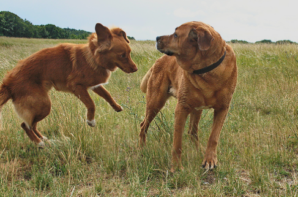

# 📸 Image Caption Generator


A Generative AI project that automatically describes the content of an image using Deep Learning. It combines **Computer Vision (InceptionV3)** and **Natural Language Processing (LSTM)** to generate accurate, human-like captions.

## 🚀 Live Demo
The model is deployed and running live! You can test it with your own images here:
**[👉 Click here to try the Live App on Hugging Face](https://huggingface.co/spaces/RupamG/Image_Captioning_System)**

---

## 🧠 Technical Architecture
This project uses an **Encoder-Decoder** architecture:

1.  **Image Encoder (InceptionV3):**
    * We use a pre-trained InceptionV3 model (trained on ImageNet) to extract high-level visual features from images.
    * The last classification layer is removed, leaving us with a feature vector of shape `(2048,)`.
2.  **Sequence Decoder (LSTM):**
    * The extracted image features are passed to an LSTM (Long Short-Term Memory) network.
    * The LSTM learns to generate a sequence of words (caption) based on the image features and the previous words generated.

**Model Pipeline:**
`Input Image` ➡️ `InceptionV3` ➡️ `Feature Vector` ➡️ `LSTM` ➡️ `Predicted Caption`

---

## 📂 Dataset
The model was trained on the **Flickr8k Dataset**, which consists of:
* **8,000 images** (6,000 training, 1,000 val, 1,000 test).
* **5 captions per image** (Total 40,000 captions).

*> **Note:** Due to size constraints, the raw dataset is not included in this repository. You can download it from [Kaggle](https://www.kaggle.com/adityajn105/flickr8k) and place it in the `src/` folder.*

---

## 🛠️ Installation & Setup
To run this project locally on your machine:

1.  **Clone the repository:**
    ```bash
    git clone https://github.com/Marshal-GG/Advanced-Image-Captioning-System.git
    cd Advanced-Image-Captioning-System
    ```

2.  **Install dependencies:**
    ```bash
    pip install -r requirements.txt
    ```

3.  **Download the Data:**
    * Download Flickr8k images and `Flickr8k.token.txt`.
    * Place them in the `src/` folder (or update paths in the notebook).

4.  **Run the Training Notebook:**
    * Open `main.ipynb` to see the data preprocessing, model training, and evaluation steps.

5.  **Run the App:**
    ```bash
    python app.py
    ```

---

## 📊 Results
* **Metric:** The model effectiveness is evaluated using qualitative analysis (visual inspection).
* **Sample Output:**
    * *Input:* Image of a 2 dogs running on grass.
    * 
    * *Output:* "Two dogs are playing together in the grass"

---

## 🤝 Connect
If you have any questions about this project or want to discuss Generative AI, feel free to connect!
* **LinkedIn:** [https://www.linkedin.com/in/rupam-g/]
* **Email:** [marshalgcom@gmail.com]
